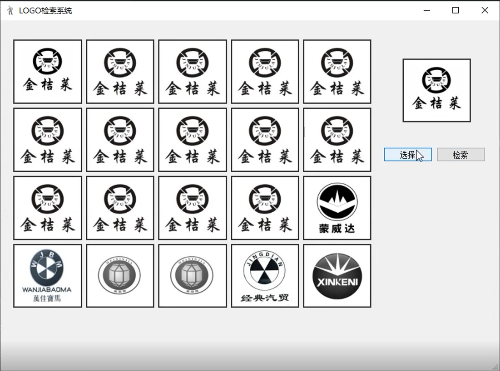

# ImageRetrievalSystem
A Logo Retrieval System with interface based on python3, Pyqt5 and pre-trained Resnet neural network. which can be run on windows platform.

## Requirements
Python3\
PyQt5\
pytorch==1.3.1\
torchvision==0.4.2\
tqdm==4.40.0\
scipy\
numpy
## Example

## Contact me if there are any questions
jianglx@whu.edu.cn
